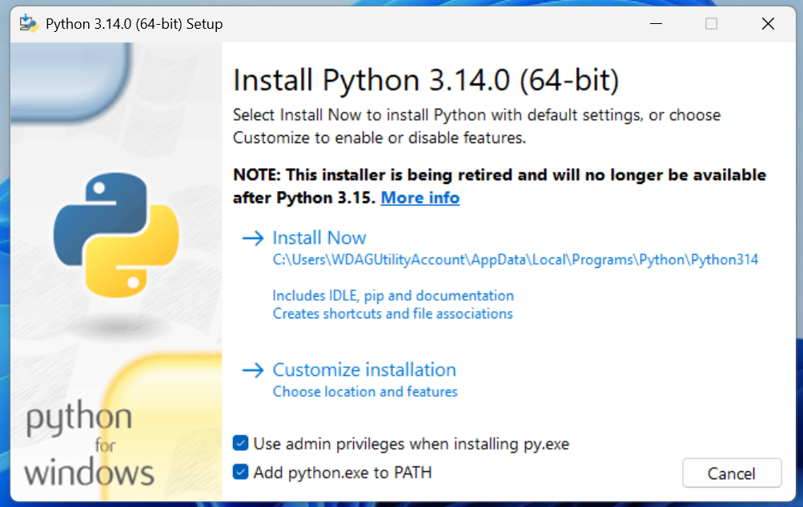

# Instrucciones

El siguiente programa funciona desde Windows única y exclusivamente. Necesita de python 3.14 como mínimo para funcionar.

## Instalación de Python

1. Descarga e instala Python para Windows desde la página oficial: [https://www.python.org/downloads/windows/](https://www.python.org/downloads/windows/)

2. Asegúrate de marcar la opción "Add Python to PATH" durante la instalación.




## Instalación de dependencias

1. Abre una terminal (puedes usar "Símbolo del sistema" o "PowerShell").

2. Verifica que python esté instalado con el siguiente comando:

```bash
python -m pip install --upgrade pip
```

3. Instala todas las dependencias necesarias utilizando pip con el siguiente comando:

```bash
pip install -r requirements.txt
```

## Ejecución del programa

1. Ejecuta el archivo `launcher.exe` haciendo doble clic sobre él o desde la terminal con el siguiente comando:

```bash
.\launcher.exe
```


